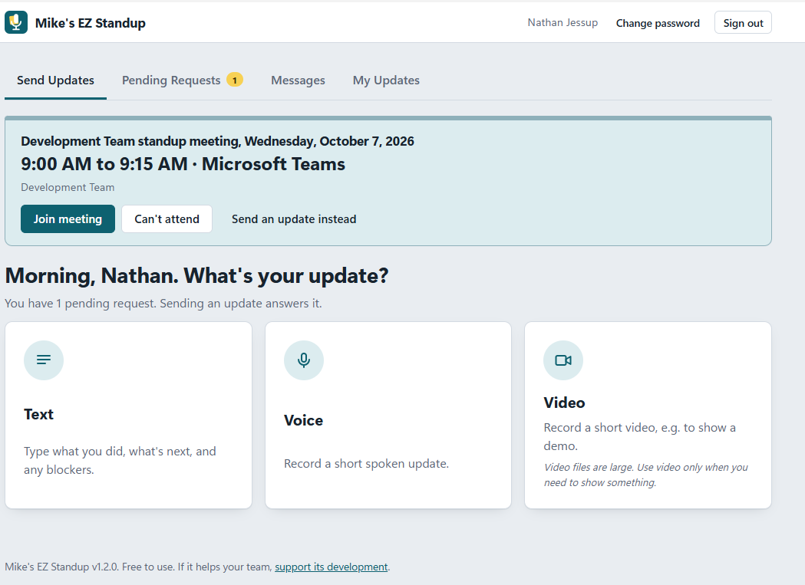
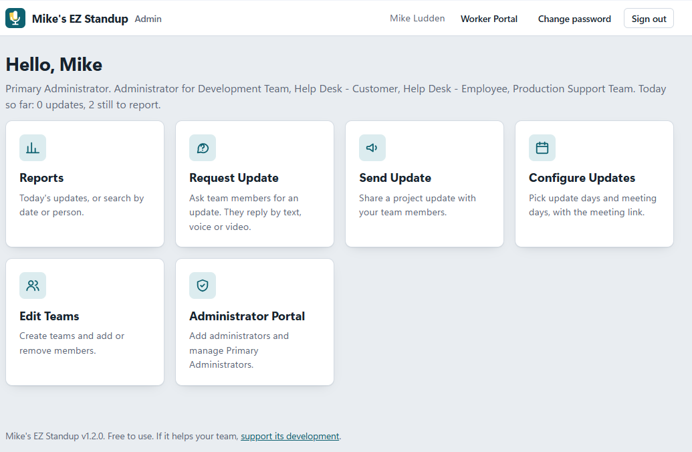
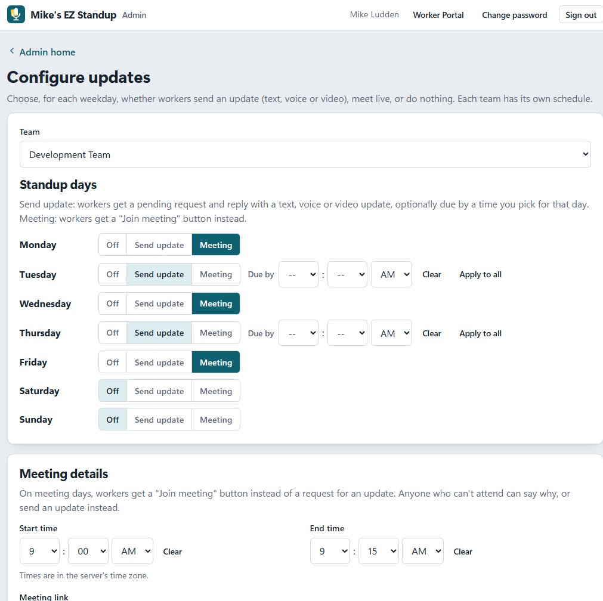
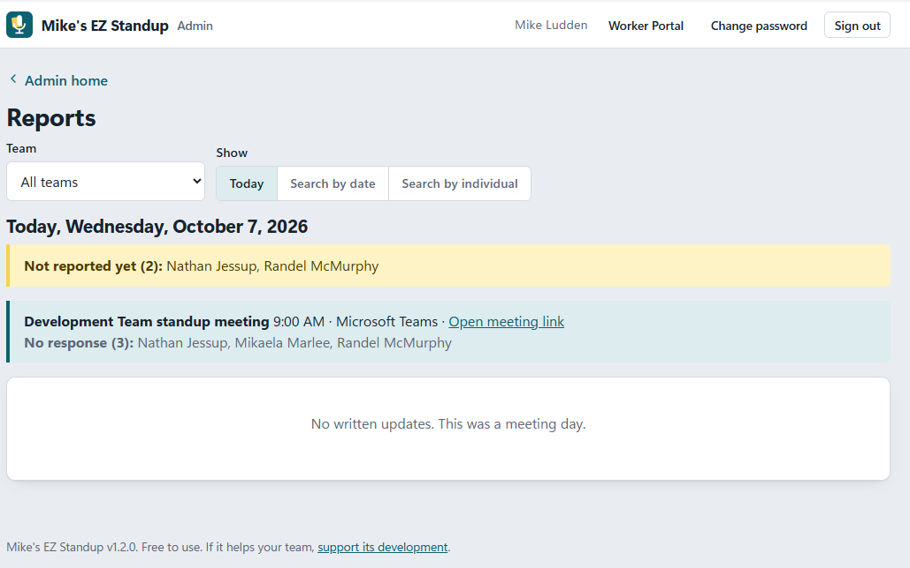

# Mike's EZ Standup

Daily standups for software teams, by text, voice or video.

You install it once, on one computer on your network (the **server**). Everyone else uses it
from their own computer, with nothing to install unless they want to.

Mike's EZ Standup is free. If it helps your team, please [support its development](YOUR-STRIPE-LINK).

Questions, comments or suggestions? Email me at michaeldludden@gmail.com, or
[open an issue](../../issues) here on GitHub.

**Guides:** [Workers](README-WORKER.md) · [Administrators](README-ADMIN.md) ·
[Desktop app](desktop/README.md) · [Email with Brevo](EMAIL-BREVO.md)

## Screenshots

**Team members** send their update by text, voice or video, or join the day's standup meeting:



**Administrators** get reports, update requests, project updates, schedules, teams and admin management:



Each team's week is set day by day: send an update (optionally due by a set time), meet live, or nothing:



Reports show who has reported, who hasn't, and who joined the meeting:



---

## What you need

- A computer to act as the server, on your network and always on (Windows, macOS or Linux),
  with **Node.js 20 or newer** from https://nodejs.org (the LTS version).
- An **email (SMTP) account** for invitations and password resets. Optional: without one,
  emails are saved to a folder and admins get links to pass on by hand.
- For everyone else: a current browser (Chrome, Edge, Firefox or Safari), or the Windows
  desktop app.

## 1. Install the server

1. Copy the `mikes-ez-standup` folder to the server, for example `C:\Apps\mikes-ez-standup`.
2. In that folder, double-click **`install.bat`** (Windows) or run `sh install.sh`
   (macOS/Linux). It downloads the packages the app needs, then asks for:
   - the **Primary Administrator's email, name and password** (the first admin account),
   - the **address** people will use to reach the server (its name or IP address),
   - whether to turn on **HTTPS** (see [Turning on HTTPS](#turning-on-https); you can
     say no and do it later),
   - the **port** (8080, or 8443 with HTTPS),
   - your **email (SMTP)** settings (optional; you can add them later).
3. Start the server: double-click **`start.bat`** (Windows), or run `npm start`.
   Keep that window open; it shows the version, the app folder, and the address to open.
4. Open `http://<server>:8080/admin` (or `https://<server>:8443/admin`), sign in as the
   Primary Administrator, and create your first team in **Edit Teams**.

To start the server automatically with the computer, see [Running it as a service](#running-it-as-a-service).

## 2. Connect your team

The app runs in a web browser, so people don't need to install anything. There are three
ways to open it; pick whichever suits each person:

| Option | Best for | What they do |
| --- | --- | --- |
| **Browser** | Anyone, any device | Open `http://<server>:8080/worker` (admins: `/admin`). |
| **Windows desktop app** (recommended on Windows) | Windows 10/11 users | Install it once. It has its own window, a tray icon, and reminders when an update or meeting is due. Voice and video work without HTTPS. |
| **Shortcut installers** | People who just want a desktop icon | Run a small installer that puts a shortcut on the desktop and opens the browser. |

All three are offered at `http://<server>:8080/downloads`, and are in the server's
`installers` folder if you prefer to share them on a network drive.

**Building the desktop app (once):** install the free .NET SDK (version 8 or newer) on any
Windows PC, then double-click `desktop\build.cmd`. The finished app appears on the downloads
page. Details are in [desktop/README.md](desktop/README.md).

## Email setup

Add your SMTP server's details to the `smtp` section of `config/config.json`, then restart
the server:

```json
"smtp": {
  "host": "smtp.yourcompany.com",
  "port": 587,
  "secure": false,
  "user": "standup@yourcompany.com",
  "pass": "your-smtp-password",
  "from": "Mike's EZ Standup <standup@yourcompany.com>"
}
```

- `host`, `user` and `pass` come from your email provider or IT team.
- Use port **587** with `"secure": false` (most providers). Only port **465** uses `"secure": true`.
- `from` must be an address your provider allows you to send from.

To check it, run this in the app folder (it signs in and sends you a test email, or says
exactly what to fix):

```
node install/test-email.js you@yourcompany.com
```

Until email works, messages are saved in `data/outbox/`, and admins see a sign-up link they
can send by hand when adding someone. Using Brevo? See [EMAIL-BREVO.md](EMAIL-BREVO.md).

## Turning on HTTPS

You only need HTTPS for **voice and video in a browser on other computers**: browsers allow
the microphone and camera only on secure (`https://`) pages. Text updates work without it,
and the Windows desktop app records voice and video without it.

To turn it on, stop the server and run this in the app folder:

```
node install/enable-https.js
```

It creates a certificate, switches to `https://` on port 8443, and updates the installers.
(The installer does the same if you answered yes to HTTPS.)

Because the server makes its own ("self-signed") certificate, browsers show **"Not secure"**
until each computer trusts it once. The connection is still encrypted. To fix it:

- **Each person:** on the `/downloads` page (there's a link on the sign-in page), download
  **Trust-Certificate-Windows.bat**, double-click it, choose **Yes** at the security warning,
  then close all browser windows and reopen the app. No administrator rights needed. Mac and
  Firefox steps are in the README.txt next to it.
- **IT, for everyone at once:** push `config/certs/cert.pem` to "Trusted Root Certification
  Authorities" with Group Policy, or use a certificate from your company instead:
  `node install/enable-https.js --cert=company.crt --key=company.key`.

Open the app with the same address the installer was given (or `localhost` on the server).
The desktop app trusts your server's certificate automatically.

## Settings

`config/config.json` holds the server's settings. Restart the server after changing it.

| Setting | Meaning |
| --- | --- |
| `publicUrl` | The address used in email links, e.g. `http://standup-pc:8080` |
| `port` | The port the server listens on |
| `smtp` | Email settings (see [Email setup](#email-setup)) |
| `maxRecordingSeconds` | Longest voice or video recording (default 180) |
| `maxUploadMB` / `maxVideoMB` | Largest voice recording / video accepted (default 20 / 150) |
| `logRetentionDays` | How long log files are kept (default 90) |

## Your data and backups

Everything the app stores is in two folders inside the app folder: **`config`** (settings
and certificate) and **`data`** (people, teams, updates, recordings, and daily backups of the
database kept for 30 days). **Back up these two folders.**

- How long old messages and updates are kept is set by a Primary Administrator in the
  Administrator Portal (see [README-ADMIN.md](README-ADMIN.md), "Storage & cleanup").
- Activity and error logs are in the `logs` folder.
- Don't edit `data/db.json` while the server is running; it would be overwritten. Names and
  roles can be changed in **Edit Teams** instead.

## Running it as a service

So the server starts with the computer and runs without anyone signed in:

- **Windows:** in Task Scheduler, create a task that runs `start.bat` "At startup", with
  "Run whether user is logged on or not". (Or use a service tool such as NSSM.)
- **Linux:** edit and copy `install/mikes-ez-standup.service` to `/etc/systemd/system/`, then
  run `sudo systemctl enable --now mikes-ez-standup`.
- **macOS:** create a LaunchDaemon that runs `node server/server.js` in the app folder.

## Reinstalling

Run the installer again (`install.bat` or `node install/install-server.js`). It finds the
existing installation and lets you **keep** your teams and data while setting a new Primary
Administrator, or start **fresh** (old data is moved to `data-archive`).

**There must always be at least one Primary Administrator.** The app won't let you remove the
last one. If your company ever ends up without one (for example, they left and their
account can't be used), reinstall as above and choose "keep" to set a new one.

## Troubleshooting

- **"Port … is already in use" when starting:** the server is already running in another
  window. Close that window (or press Ctrl+C in it) and start again.
- **The page looks out of date:** check the version at the bottom of the page, then press
  Ctrl+F5 (F5 in the desktop app).
- **Can't record voice or video in a browser:** turn on HTTPS, or use the desktop app.
- **Emails don't arrive:** run `node install/test-email.js you@yourcompany.com`.
- **Schedules happen at the wrong time:** times use the server computer's time zone and clock.

## Security

Passwords are stored securely hashed, sign-in is rate-limited, and email links work once and
expire. Recordings are only available to people allowed to hear or see them. Keep the server
on your company network; if you put it on the internet, place it behind your usual web
gateway with a proper certificate.

## License

Free and open source under the [MIT License](LICENSE).
